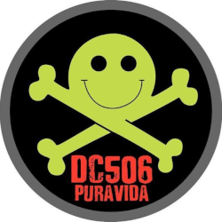

# Reto DC506 #4 - Agosto

Fuente: [geekl0g](https://geekl0g.wordpress.com/2019/09/02/reto-dc506-4-agosto/)



El grupo de ciberseguridad DC506 ha estado realizando, mes a mes, una serie de desafíos para que sus integrantes se diviertan resolviendo retos y acertijos de ciberseguridad, hacking e informática. El reto #4 correspondiente al mes de Agosto inicia con un archivo comprimido: zero.zip.

El primer paso fue, verificar qué hay dentro del Zip. Se extrae un único archivo: zero.txt; que a simple vista parece un archivo lleno de ceros (0). Se verificó el tipo de archivo con el comando `file` en la terminal de Linux.

```
$ file zero.txt
zero.txt: UTF-8 Unicode text, with very long lines, with no line terminators
```


Se trata de un archivo de texto plano en formato UTF-8, sin embargo debe haber algo más. Por lo que el siguiente paso fue utilizar `cat` para verificar caracteres "ocultos".

```
$ cat --show-all zero.txt
0M-bM-^@M-^LM-bM-^@M-^K0M-bM-^@M-^KM-bM-^@M-^L0......
```


¡Ahora estamos viendo algo!

Para poder cambiar esos caracteres ocultos en algo que se pueda interpretar necesitamos saber cuáles son esos caracteres en primer lugar. Se utilizó el comando `xxd` para ver los valores hexadecimales (HEX) del archivo; este comando es útil para poder analizar archivo binarios también.

```
$ cat zero.txt | xxd
00000000: 30e2 808c e280 8b30 e280 8be2 808c 30e2  0......0......0.
00000010: 808c e280 8b30 e280 8be2 808c 30e2 808c  .....0......0...
00000020: e280 8b30 e280 8be2 808c 30e2 808b e280  ...0......0.....
00000030: 8b30 e280 8ce2 808c 30e2 808c e280 8b30  .0......0......0
00000040: e280 8be2 808c 30e2 808c e280 8c30 e280  ......0......0..
00000050: 8ce2 808b 30e2 808c e280 8b30 e280 8be2  ....0......0....
00000060: 808c 30e2 808c e280 8b30 e280 8be2 808b  ..0......0......
```

De la tabla ASCII o Unicode, sabemos que el número HEX 30 representa el carácter "0", pero tenemos otros dos caracteres representados por los hexadecimales `E2808B`(ZERO WIDTH SPACE) y `E2808C` (ZERO WIDTH NON-JOINER). Esos dos caracteres se repiten a lo largo del archivo, en una secuencia que recuerda a 0's y 1's en un mensaje en binario; así que se procedió a ignorar completamente los caracteres de "0", borrándolos del archivo y sustituyendo `E2808C` por "0" y `E2808B` por "1".

> La elección de cuál sería 0 y cuál sería 1 fue aleatoria, si esa forma no arrojaba resultados se probaría intercambiándolos. 

Para poder cambiar los caracteres se utilizó el comando `sed` escapando los caracteres hexadecimales y sustituyendo por "0" y por "1" correspondientemente.

```
$ cat zero.txt | sed 's/0//g' > sin_zero.txt
$ cat sin_zero.txt | sed 's/\xE2\x80\x8C/0/g' > cero.txt
$ cat cero.txt | sed 's/\xE2\x80\x8B/1/g' > cerouno.txt
$ cat cerouno.txt
01100110011011000110000101100111011110110110001101110010011110010111000001110100011011110111001101110100011001010110011101110111011010010111010001101000011110100110010101110010011011110111011101101001011001000111010001101000011100110111000001100001011000110110010101101110011011110110111001101010011011110110100101101110011001010111001001111101
```

Ahora esa secuencia binaria puede intentar decodificarse, ya sea en un sitio en Internet para convertir Binario a ASCII o se puede utilizar la linea de comandos.

De hecho todo el proceso se puede hacer en una sola linea de la siguiente manera, utilizando `perl`(From Stackexchange):

```
$ cat zero.txt | sed 's/0//g' | sed 's/\xE2\x80\x8C/0/g' | sed 's/\xE2\x80\x8B/1/g' | perl -lpe '$_=pack"B*",$_'
flag{cryptostegwithzerowidthspacenonjoiner}
```


¡Así que nuestro **flag** secreto es `cryptostegwithzerowidthspacenonjoiner`!

